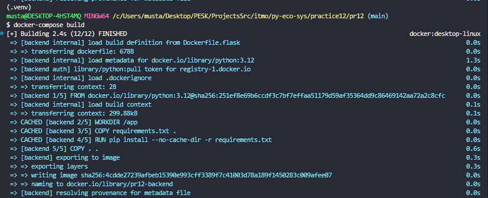
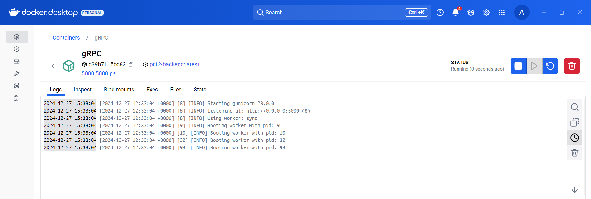
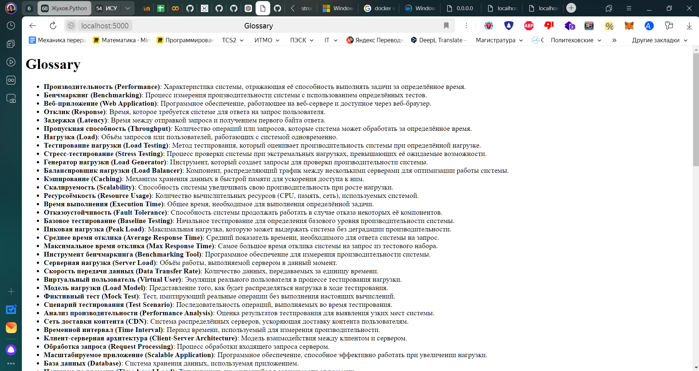
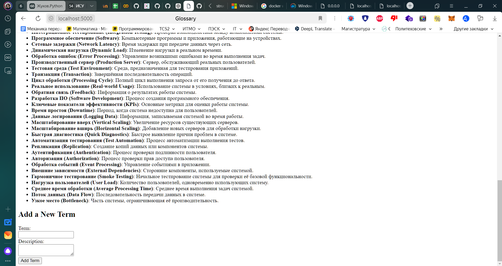
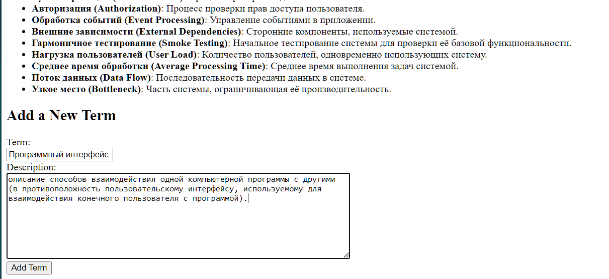
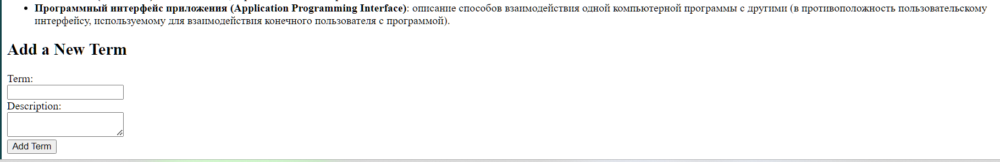

# Подходы к разработке и развертыванию микросервисных решений на Python
Мустафин А. Р.
## RPC. gRPC. Protobuf

На основе продемонстрированного [примера](https://colab.research.google.com/drive/1ebY2plg9D_QupFdHVBtVqQXO7XpWy7At?usp=sharing) и [мини-проекта](https://github.com/nzhukov/grpc_lib_rec_demo) с реализацией двух сервисов (рекомендация книг), [реализуйте задание](https://kodaktor.ru/g/itmo_technopr3) практики, опубликованное по ссылке, с использованием gRPC, protobuf, предоставьте ссылку на репозиторий GitHub со всеми необходимыми компонентами для развертывания. При возможности, разверните словарь на публичном сервере в вебе. 

В репозитории отразите отчет с помощью файла с разметкой Markdown, где демонстрировался бы процесс развертывания и работы сервиса.

### Процесс развёртывания

### Процесс работы сервиса

#### Добавление нового термина

